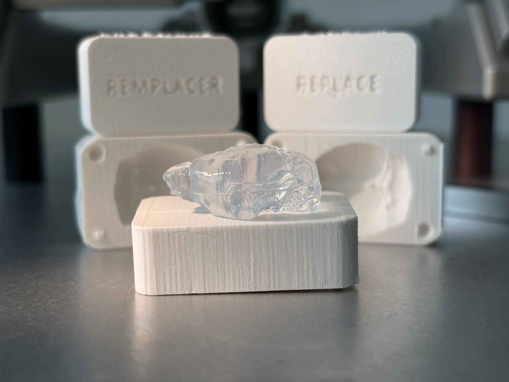
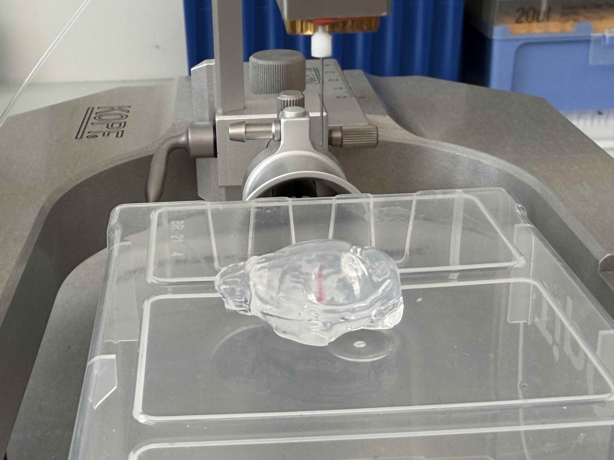

# REMPLACER — Agarose Mouse Brain Mould / Moule cerveau de souris en agarose

<p align="center">
  
</p>

**FR** | [EN below](#english-version)

---

## Version française

Ce dépôt contient les fichiers d'un moule en deux parties permettant de fabriquer des cerveaux de souris en **agarose**, utilisés dans l'atelier de médiation scientifique **REMPLACER** depuis 2017.

Le moule a été conçu à partir de **données anatomiques réelles de souris, librement accessibles en ligne**, et d'un générateur de moule paramétrique open source (voir [Sources & crédits](#sources--crédits)). Il permet de produire un modèle translucide utilisable avec un cadre stéréotaxique standard, **sans utiliser aucun animal**.

### 🙋 Vous avez utilisé ce moule ? Partagez vos retours !

Vous avez fabriqué des cerveaux en agarose pour votre labo, vos TP ou un atelier de médiation ? **Partagez votre expérience en ouvrant une [Issue](../../issues) sur ce dépôt** — photos, adaptations, retours de publics, versions modifiées du moule : tout est bienvenu. Si c'est plus simple, vous pouvez aussi écrire directement à : philippe.zizzari@inserm.fr.

Ces retours nous aident à améliorer le dispositif et à documenter son impact. Ils sont aussi précieux pour convaincre nos institutions de continuer à soutenir ce type de projet 🙂

> 🛠️ Si vous adaptez le moule, **merci de forker ce dépôt** plutôt que de redistribuer les fichiers séparément — cela préserve la traçabilité et permet à tout le monde de bénéficier des améliorations.

### Contenu du dépôt

```
/scad/
    mould_remplacer.scad   — source paramétrique (en-tête d'attribution inclus)
    mold_file.stl          — STL du cerveau aligné (importé par le .scad)
/stl/
    mould_x1_5.stl         — moule à ×1.5 (cerveau de souris adulte ~24 mm)
    mould_x1_75.stl        — moule à ×1.75 (souris large / rat juvénile ~28 mm)
    mould_x3.stl           — moule à ×3 (version atelier, braille tactile lisible)
/brain/
    README.md              — lien NITRC + notes de conversion .nii → STL (VTK)
/scripts/
    align_stl.py           — réoriente automatiquement un STL exporté de Slicer
PROTOCOL.md                — protocole de fabrication des cerveaux en agarose
CREDITS.md                 — attributions complètes (cerveau, Webb, rocketboy)
LICENSE                    — licence CC BY-NC-SA 4.0
```

> Le fichier de cerveau d'origine (`.nii`) **n'est pas redistribué ici**. En revanche, le STL pré-aligné (`/scad/mold_file.stl`) est inclus pour que le `.scad` compile directement après le clone — c'est aussi un dérivé du template NITRC, autorisé par sa licence CC BY-NC-SA. Voir le dossier [`/brain/`](brain/) si tu veux **régénérer** le STL depuis le `.nii` (par exemple pour un autre template, une autre espèce, ou pour adapter la résolution du maillage). Dans ce cas, fais-le passer par [`scripts/align_stl.py`](scripts/align_stl.py) avant de l'utiliser dans le `.scad` (voir [`brain/README.md`](brain/README.md) §3).

### Protocole rapide

1. Imprimer les deux parties du moule (PLA, résolution 0.2 mm recommandée)
2. Préparer une solution d'agarose à 1 à 2 % dans de l'eau distillée (1 % donne plus de translucidité, 2 % plus de tenue). **Astuce pratique** : verser la poudre dans l'eau, remuer, passer **30 s au micro-ondes** — ça dissout nickel. ⚠️ Le bord du bécher devient brûlant.
3. Fermer le moule en scotchant les deux parties sur la tranche, puis ajouter des bandes de scotch à 90° pour assurer l'étanchéité ; couler l'agarose encore chaud
4. Laisser polymériser ~15 min à température ambiante, puis ≥20 min à 4 °C (à ajuster selon vos conditions — **attendre vraiment** la polymérisation complète, c'est ce qui détermine la réussite du démoulage)
5. Démouler délicatement

### Impression et réglage des gravures

**Impression** — PLA, résolution 0.2 mm, remplissage 15–20 %. Les deux moitiés peuvent être imprimées face arrière sur le plateau (face avec le texte) : le texte apparaît bien net sur la première couche. Des supports sont nécessaires pour le canal de coulée et le braille (cf. [`PROTOCOL.md`](PROTOCOL.md) pour la procédure de *support blocker* dans la cuvette).

**Réglage des gravures** — toutes les valeurs sont paramétrables en haut du fichier [`scad/mould_remplacer.scad`](scad/mould_remplacer.scad) (bloc *Engraving parameters*) :

| Paramètre | Défaut | Rôle |
|---|---|---|
| `text_depth` | 1.2 mm | profondeur de gravure du texte REMPLACER / REPLACE |
| `text_size` | 9 mm | hauteur des lettres |
| `text_mirror_top` / `text_mirror_bottom` | `false` / `true` | si le texte apparaît en miroir une fois la pièce retournée, inverse |
| `braille_dot_d` | 1.5 mm | diamètre du point au contact (lisibilité tactile) |
| `braille_dot_h` | 0.75 mm | **hauteur du point qui dépasse** — indépendante du diamètre |
| `braille_dot_dist` | 2.5 mm | espacement entre points d'une cellule (norme Marburg) |
| `braille_cell_pitch` | 6.0 mm | espacement entre cellules (norme Marburg) |

> Le standard Marburg français pour le braille est d ≈ 1.5 mm et h ≈ 0.5 mm. La valeur par défaut de `braille_dot_h` est volontairement un peu plus haute (0.75 mm) pour compenser l'écrasement d'un point en PLA à 0.2 mm de couche. À ajuster selon ton imprimante : descends vers 0.5 mm si tes points ressortent trop pointus, monte vers 1 mm si on les sent à peine.

### En usage / In use

<p align="center">
  
</p>

**🇫🇷** Cerveau en agarose moulé avec ce dispositif, positionné dans un cadre stéréotaxique standard. La trace rouge à l'intérieur du gel est une démonstration d'injection : le cerveau translucide permet de **voir en direct** la trajectoire de l'aiguille et le site de dépôt — un atout pédagogique central pour la formation en chirurgie stéréotaxique.

**🇬🇧** Agarose brain cast with this device, mounted in a standard stereotaxic frame. The red trace inside the gel is a demonstration injection: the translucent brain lets you **see in real time** the needle trajectory and the deposition site — a key teaching advantage for stereotaxic surgery training.

### Sources & crédits

Ce moule est un **travail dérivé**. Il réunit :

- le template anatomique de cerveau de souris C57BL/6 de **Hikishima et al. (2017)**, via NITRC (*tpm_mouse*), converti de NIfTI en STL ;
- le générateur de moule paramétrique en deux parties de **Jason Webb**, dans la version modifiée par **Dan Steele (rocketboy)** ;
- mes propres ajouts : positionnement du cerveau, canal de coulée oblique aligné sur le tronc cérébral, textes **REMPLACER / REPLACE** et leur transcription en **braille**.

La liste complète — liens, licences de chaque maillon et **citation à utiliser** — est dans [`CREDITS.md`](CREDITS.md). Merci de la conserver en cas de réutilisation.

### Licence

Ce travail est mis à disposition sous licence [Creative Commons Attribution — Pas d'Utilisation Commerciale — Partage dans les Mêmes Conditions 4.0 International (CC BY-NC-SA 4.0)](https://creativecommons.org/licenses/by-nc-sa/4.0/).

**En résumé :** vous pouvez utiliser, adapter et redistribuer ces fichiers librement, à condition de **citer les auteurs** (voir [`CREDITS.md`](CREDITS.md)), de **ne pas en faire un usage commercial**, et de **partager vos adaptations sous la même licence**.

Cette licence est imposée par le template de cerveau amont (CC BY-NC-SA) dont la géométrie est dérivée.

> 📝 **À titre personnel** — Ce dépôt et son contenu sont publiés à titre personnel par l'auteur. Les opinions, choix techniques et engagements qui y sont exprimés n'engagent que lui et ne reflètent pas nécessairement la position de l'INSERM ni de l'Université de Bordeaux. Les affiliations sont mentionnées à titre informatif uniquement.

**Auteur :** Philippe Zizzari — Ingénieur de Recherche, INSERM U1215, Neurocentre Magendie, Université de Bordeaux
**Contact :** philippe.zizzari@inserm.fr
**Site du projet :** [https://g0ub.github.io/remplacer/](https://g0ub.github.io/remplacer/)

---

## English version

This repository contains a two-part mould for casting **agarose** mouse brain models, used in the **REMPLACER** science outreach workshop since 2017.

The mould was designed from **real mouse anatomical data, freely available online**, together with an open-source parametric mould generator (see [Sources & credits](#sources--credits)). It produces a translucent model usable with a standard stereotaxic frame — **no animals required**.

### 🙋 Have you used this mould? Share your feedback!

Have you cast agarose brains for your lab, teaching practicals, or an outreach event? **Open an [Issue](../../issues) to share your experience** — photos, adaptations, audience feedback, modified versions of the mould: all welcome. If it's easier, you can also reach us directly by email: philippe.zizzari@inserm.fr.

Your feedback helps us improve the device and document its reach. It also helps make the case to our institutions for continuing to support this kind of project 🙂

> 🛠️ If you adapt the mould, **please fork this repository** rather than redistributing the files separately — this preserves traceability and lets everyone benefit from improvements.

### Repository contents

```
/scad/
    mould_remplacer.scad   — parametric source (attribution header included)
    mold_file.stl          — aligned brain STL (imported by the .scad)
/stl/
    mould_x1_5.stl         — mould at ×1.5 (adult mouse brain, ~24 mm)
    mould_x1_75.stl        — mould at ×1.75 (large mouse / juvenile rat, ~28 mm)
    mould_x3.stl           — mould at ×3 (workshop version, tactile braille)
/brain/
    README.md              — NITRC link + .nii → STL conversion notes (VTK)
/scripts/
    align_stl.py           — automatically re-orients an STL exported from Slicer
PROTOCOL.md                — agarose brain casting protocol
CREDITS.md                 — full attribution chain (brain, Webb, rocketboy)
LICENSE                    — CC BY-NC-SA 4.0 licence
```

> The original brain file (`.nii`) is **not redistributed here**. However, the pre-aligned STL (`/scad/mold_file.stl`) is included so the `.scad` compiles right after cloning — it is itself a derivative of the NITRC template, permitted by its CC BY-NC-SA licence. See the [`/brain/`](brain/) folder if you want to **regenerate** the STL from the `.nii` (e.g. for a different template, a different species, or to tweak the mesh resolution). In that case, pass it through [`scripts/align_stl.py`](scripts/align_stl.py) before plugging it into the `.scad` (see [`brain/README.md`](brain/README.md) §3).

### Quick protocol

1. Print both mould halves (PLA, 0.2 mm resolution recommended)
2. Prepare a 1-2% agarose solution in distilled water (1% gives more translucency, 2% holds its shape better). **Practical tip**: pour the powder into the water, stir, then microwave for **30 s** — dissolves perfectly. ⚠️ The beaker rim gets very hot.
3. Close the mould by taping the two halves along the seam, then add strips of tape at 90° to seal it; pour the agarose while still hot
4. Let it set for ~15 min at room temperature, then ≥20 min at 4 °C (adjust to your conditions — **really wait** for full polymerization, this is what makes the demoulding succeed)
5. Demould carefully

### Printing & tuning the engravings

**Printing** — PLA, 0.2 mm resolution, 15–20 % infill. Both halves can be printed back face on the bed (the face that carries the text): the text comes out crisp on the first layer. Supports are needed on the pour channel and the braille (see [`PROTOCOL.md`](PROTOCOL.md) for the *support blocker* procedure inside the brain cavity).

**Tuning the engravings** — all values are parameterized at the top of [`scad/mould_remplacer.scad`](scad/mould_remplacer.scad) (block *Engraving parameters*):

| Parameter | Default | Role |
|---|---|---|
| `text_depth` | 1.2 mm | engraving depth of the REMPLACER / REPLACE text |
| `text_size` | 9 mm | letter height |
| `text_mirror_top` / `text_mirror_bottom` | `false` / `true` | flip if the text reads mirrored once the part is turned over |
| `braille_dot_d` | 1.5 mm | dot base diameter (tactile readability) |
| `braille_dot_h` | 0.75 mm | **dot height above the face** — independent of the diameter |
| `braille_dot_dist` | 2.5 mm | spacing between dots in a cell (Marburg standard) |
| `braille_cell_pitch` | 6.0 mm | spacing between cells (Marburg standard) |

> The French Marburg braille standard is d ≈ 1.5 mm and h ≈ 0.5 mm. The default `braille_dot_h` is set slightly higher (0.75 mm) to compensate for dot flattening in PLA at 0.2 mm layer height. Tune it to your printer: lower to 0.5 mm if the dots come out too pointy, raise to 1 mm if they're barely tactile.

### Sources & credits

This mould is a **derivative work**. It combines:

- the C57BL/6 mouse brain anatomical template by **Hikishima et al. (2017)**, via NITRC (*tpm_mouse*), converted from NIfTI to STL;
- the parametric two-part mould generator by **Jason Webb**, in the version modified by **Dan Steele (rocketboy)**;
- my own additions: brain positioning, an oblique pour channel aligned on the brainstem, and **REMPLACER / REPLACE** text with its **braille** transcription.

The full list — links, the licence of each layer, and the **citation to use** — is in [`CREDITS.md`](CREDITS.md). Please keep it when reusing.

### Licence

This work is licensed under [Creative Commons Attribution — NonCommercial — ShareAlike 4.0 International (CC BY-NC-SA 4.0)](https://creativecommons.org/licenses/by-nc-sa/4.0/).

**In short:** you may use, adapt and redistribute these files freely, provided you **credit the authors** (see [`CREDITS.md`](CREDITS.md)), make **no commercial use**, and **share any adaptations under the same licence**.

This licence is required by the upstream brain template (CC BY-NC-SA) from which the geometry is derived.

> 📝 **Personal capacity** — This repository and its contents are published by the author in a personal capacity. The opinions, technical choices and commitments expressed here are his own and do not necessarily reflect the position of INSERM or the University of Bordeaux. Affiliations are mentioned for information only.

**Author:** Philippe Zizzari — Research Engineer, INSERM U1215, Neurocentre Magendie, Université de Bordeaux
**Contact:** philippe.zizzari@inserm.fr
**Project website:** [https://g0ub.github.io/remplacer/](https://g0ub.github.io/remplacer/)
